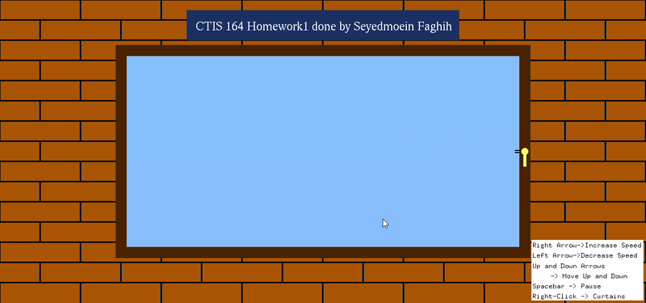

🦢 Pelican Animation in C & OpenGL

A simple yet engaging OpenGL project developed in C that animates a pelican using basic primitive shapes. The pelican moves, flaps its wings, and interacts with the environment dynamically! 🚀

✨ Features

🎮 Smooth Animation: The pelican moves left and right while its wings flap up and down.

🖱 Interactive Curtains: Right-click to pull the curtains open or close them.

⬆⬇ Vertical Movement: Control the pelican's altitude using the Up and Down arrow keys.

⏩⏪ Adjustable Speed: Increase or decrease movement speed with the Right and Left arrow keys.

⚠ Speed Alerts: A warning message appears when reaching maximum or minimum speed limits.

🏚 Breakable Wall Pattern: A custom algorithm displays a breaking pattern on the wall when interacted with.

🛠 Technologies Used

C for core programming

OpenGL for rendering and animations

🎥 Preview

🚀  🚀

🚀 Getting Started

Prerequisites

Make sure you have:

OpenGL libraries installed

A C compiler supporting OpenGL

Installation & Run

Clone the repository:

git clone https://github.com/yourusername/pelican-animation.git
cd pelican-animation

Compile the project:

gcc pelican.c -o pelican -lGL -lGLU -lglut

Run the executable:

./pelican

🎮 Controls

Action

Key

Move Up

⬆️

Move Down

⬇️

Increase Speed

➡️

Decrease Speed

⬅️

Open/Close Curtains

Right Mouse Click

📜 License

This project is open-source and available under the MIT License.

🌟 Contributions are welcome! Feel free to fork, improve, and submit a PR! 🚀

